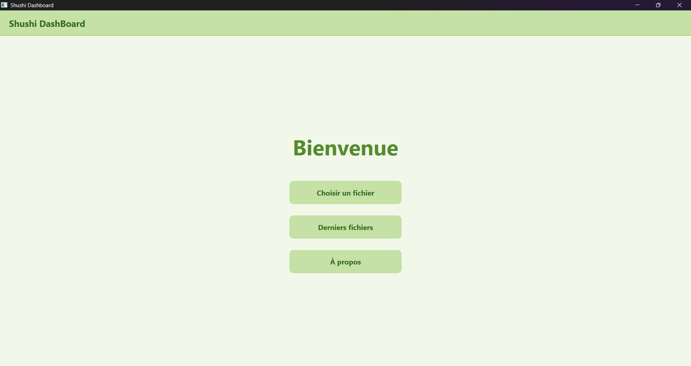
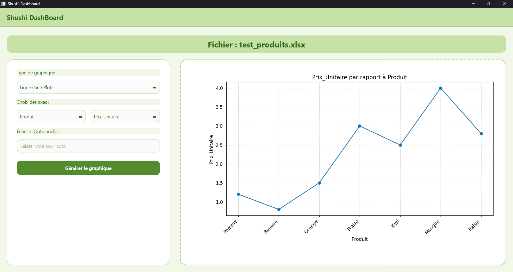
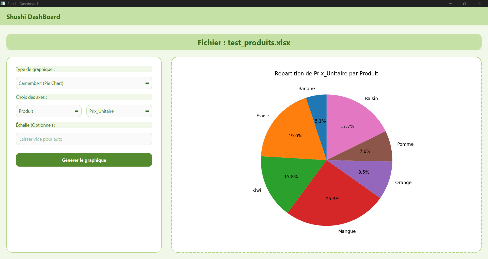

# Dashboard App

Application de visualisation de données moderne et intuitive construite avec **Python** et **PySide6 (Qt)**.

Cette application permet aux utilisateurs de transformer instantanément leurs fichiers de données (CSV, Excel) en graphiques interactifs.

## 📸 Aperçu

### Accueil
Une interface épurée et accueillante pour démarrer.


### Visualisation de Données
L'application gère intelligemment différents types de graphiques. Voici quelques exemples générés à partir de données brutes :

| Graphique en Ligne | Graphique en Camembert |
|:---:|:---:|
|  |  |

*Note : L'application supporte également les diagrammes en barres et les nuages de points (Scatter plots).*

## ✨ Fonctionnalités Clés
- **Importation Flexible** : Support natif des fichiers `.csv` et `.xlsx`.
- **Configuration Dynamique** : Détection automatique des colonnes pour le choix des axes X et Y.
- **Multi-Graphes** : Génération de 4 types de graphiques (Ligne, Barres, Scatter, Camembert).
- **Design Soigné** : Interface utilisateur moderne avec un thème "Nature" (Vert/Blanc) et des composants stylisés (arrondis, ombres).
- **Robustesse** : Gestion des erreurs de données (valeurs manquantes, textes non numériques).

## ⚠️ Note Technique (Code Core)
La logique métier complexe située dans `src/core/graph_manager.py` (responsable du traitement des données et de la génération Matplotlib) n'est pas incluse dans ce dépôt public pour des raisons de propriété intellectuelle.
Ce module a représenté un défi technique majeur pour assurer la compatibilité entre tous les types de données et de graphiques.

Pour toute question sur l'implémentation technique, n'hésitez pas à me contacter.

## 🚀 Installation et Lancement

1. **Cloner le projet**
2. **Créer un environnement virtuel** :
   ```bash
   python -m venv venv
   # Activer : venv\Scripts\activate (Windows) ou source venv/bin/activate (Mac/Linux)
   ```
3. **Installer les dépendances** :
   ```bash
   pip install -r requirements.txt
   ```
4. **Lancer l'application** :
   ```bash
   python src/main.py
   ```
